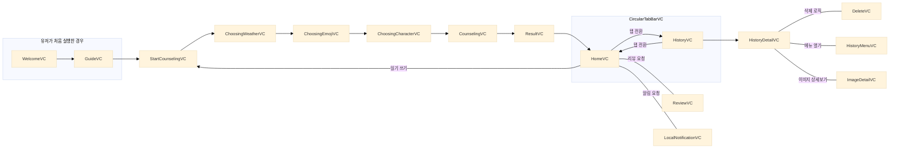
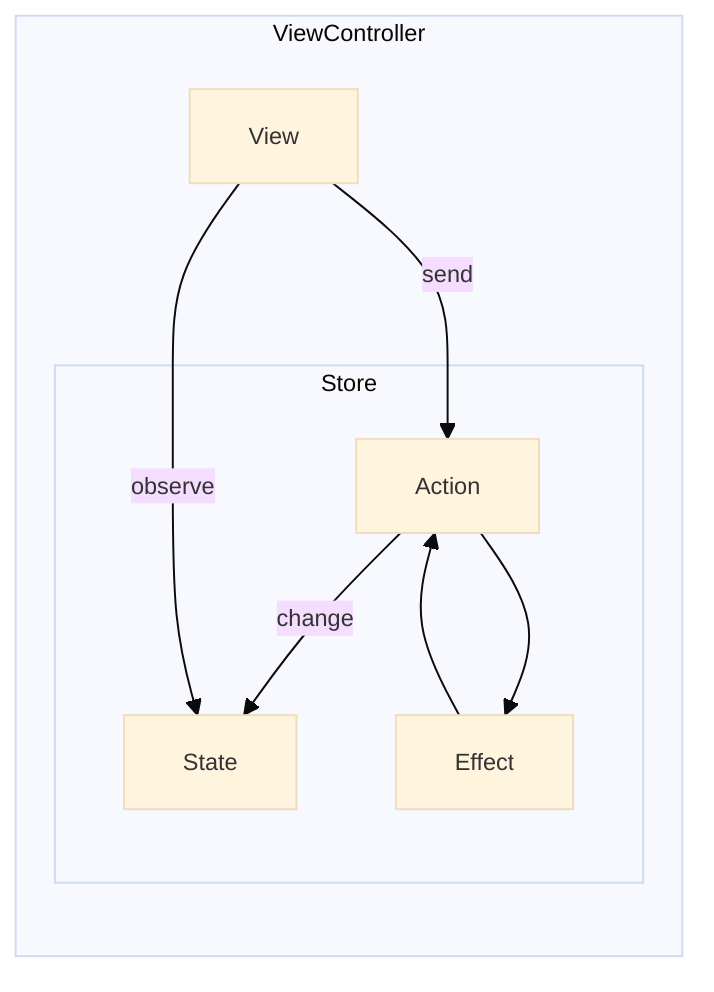

  

 

# 우리들의 다이어리, "울다"

 

### Clone & Build
API Key 때문에 실제 AI 응답을 받는 기능은 제한되어 있습니다. 
Clone 후 GloomyDiaryExample 스키마를 빌드하여 제한된 기능으로 시뮬레이션이 가능합니다. 

 

### AI 답장을 받는 일기 애플리케이션

> 우리들의 일기 다이어리 "울다"는 하루를 특별하게 기록하는 일기 애플리케이션입니다. 
> ChatGPT와 연동하여 사용자가 입력한 일기 내용에 따라 따뜻한 위로와 공감의 답장을 받을 수 있습니다. 
> 힐링이 필요한 하루를 울다와 함께 채워보세요.

 

### [앱스토어 v1.1.0](https://apps.apple.com/us/app/%EC%9A%B8%EB%8B%A4-%EC%9A%B0%EB%A6%AC%EB%93%A4%EC%9D%98-%EC%9D%BC%EA%B8%B0-%EB%8B%A4%EC%9D%B4%EC%96%B4%EB%A6%AC/id6738892165)

### [Figma](https://www.figma.com/design/4XnRA4iHJyDHKtFArvhVBG/ULDA?m=auto&t=wEoCwoRnoRfEIwtj-1)

## 

### 기술 스택
Swift, UIKit, TCA, Swift-Dependencies 
RxSwift, RxCocoa, RxRelay, RxGesture 
SwiftData, UserDefaults, OpenAI 
SnapKit, Lottie, Firebase, Amplitude 

 

### 흐름도

 

### 시연 영상
|과정|영상1|영상2|영상3|
|-|-|-|-|
| 튜토리얼 |  | | |
| 홈 | | | | 
| 편지 쓰기 |  |  | |

### MVVM 구조

