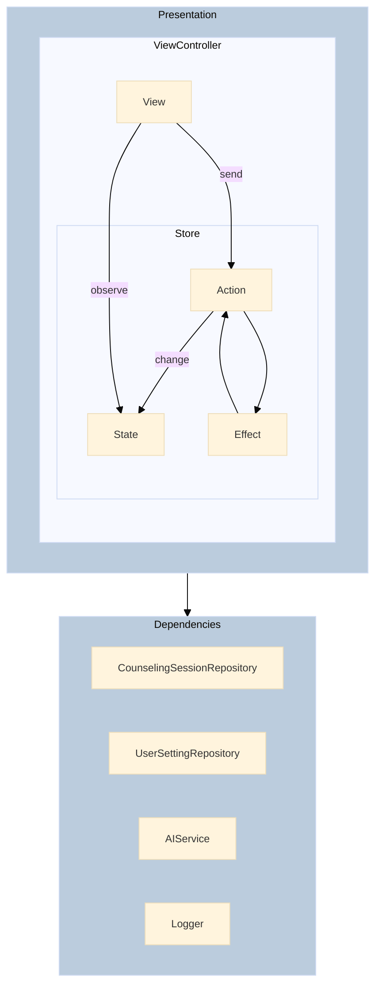

  

 

# 우리들의 다이어리, "울다"

 

## 🌙

|  |  |  |  |  |
|-|-|-|-|-|

 

## Clone & Build

 
 

API Key 때문에 실제 AI 응답을 받는 기능은 제한되어 있습니다. 
Clone 후 GloomyDiaryExample 스킴을 빌드하여 제한된 기능으로 시뮬레이션이 가능합니다. 

 

 

## 소개

### AI 답장 받는 일기 애플리케이션

> 우리들의 일기 다이어리 "울다"는 하루를 특별하게 기록하는 일기 애플리케이션입니다. 
> ChatGPT와 연동하여 사용자가 입력한 일기 내용에 따라 따뜻한 위로와 공감의 답장을 받을 수 있습니다. 
> 힐링이 필요한 하루를 울다와 함께 채워보세요.

 

|개발 기간|인원|앱스토어|
|-|-|-|
|2024.07 ~ 진행 중|1인||

 

## 

### 기술 스택
Swift, UIKit, TCA, Swift-Dependencies 
RxSwift, RxCocoa, RxRelay, RxGesture 
SwiftData, UserDefaults, OpenAI 
SnapKit, Lottie, Firebase, Amplitude 

 

### 구조

 

### 구현사항
📌 제네릭 뷰를 갖는 BaseViewController를 통해 뷰와 뷰 컨트롤러 코드 분리 
📌 TCA Reducer를 통해 MVVM 구현 및 Swift-Dependencies를 통한 의존성 관리 
📌 애니메이션 옵션을 지정하여 Swift Concurrency 형태로 실행할 수 있는 커스텀 Animation / AnimationGroup 구현 
📌 커스텀 애니메이션 및 탭바가 적용된 CircularTabBarController 구현 (로그 제거 예정) 
📌 커스텀 이미지 캐시 구현 
📌 VersionedSchema를 통한 마이그레이션 

 

### 트러블슈팅
[[UICollectionView Scroll Hitch 최적화 및 이미지 처리 개선]](https://github.com/LURKS02/GloomyDiary/wiki/%08UICollectionView-Scroll-Hitch-%EC%B5%9C%EC%A0%81%ED%99%94-%EB%B0%8F-%EC%9D%B4%EB%AF%B8%EC%A7%80-%EC%B2%98%EB%A6%AC-%EA%B0%9C%EC%84%A0) 
[[UIViewControllerAnimatedTransitioning 관련 이슈]](https://github.com/LURKS02/GloomyDiary/wiki/UIViewControllerAnimatedTransitioning-%EA%B4%80%EB%A0%A8-%EC%9D%B4%EC%8A%88) 

 

---

##### 이슈 네이밍 :  [FEATURE / FIX / REFACTOR / DOCS] 작업 내용

##### 브랜치 전략 :  main: 배포용 / develop: 기능 통합용 / (feature, fix, refactor) branch: 새로운 기능 개발

##### 브랜치 네이밍 :  feature/#이슈번호/작업 내용

