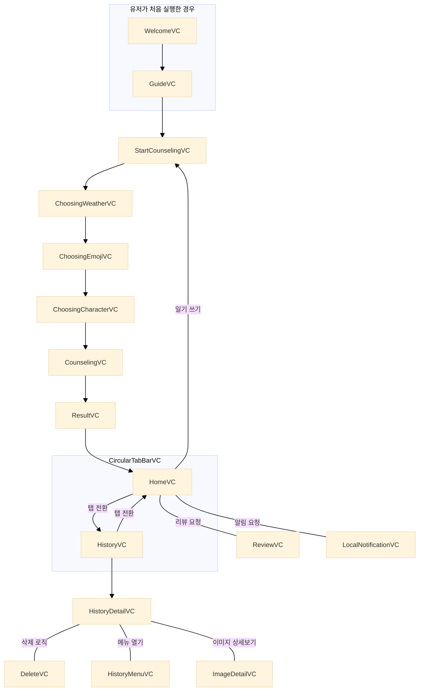
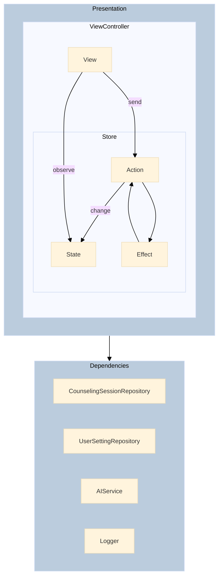

  

 

# 우리들의 다이어리, "울다"

 

### Clone & Build

API Key 때문에 실제 AI 응답을 받는 기능은 제한되어 있습니다. 
Clone 후 GloomyDiaryExample 스킴을 빌드하여 제한된 기능으로 시뮬레이션이 가능합니다. 

 

### AI 답장을 받는 일기 애플리케이션

> 우리들의 일기 다이어리 "울다"는 하루를 특별하게 기록하는 일기 애플리케이션입니다. 
> ChatGPT와 연동하여 사용자가 입력한 일기 내용에 따라 따뜻한 위로와 공감의 답장을 받을 수 있습니다. 
> 힐링이 필요한 하루를 울다와 함께 채워보세요.

 

### 앱스토어 v1.1.0

 

### [Figma](https://www.figma.com/design/4XnRA4iHJyDHKtFArvhVBG/ULDA?m=auto&t=wEoCwoRnoRfEIwtj-1)

 

## 

### 기술 스택
Swift, UIKit, TCA, Swift-Dependencies 
RxSwift, RxCocoa, RxRelay, RxGesture 
SwiftData, UserDefaults, OpenAI 
SnapKit, Lottie, Firebase, Amplitude 

 

### 흐름도

### 구조

### 시연 영상
|과정|영상1|영상2|영상3|
|-|-|-|-|
| 튜토 리얼 |  | | |
| 홈 |  |  | | 
| 편지 쓰기 |  |  |  |
| 히스 토리 |  |  | | 

 

### 트러블슈팅
[[UICollectionView Scroll Hitch 최적화 및 이미지 처리 개선 1]](https://github.com/LURKS02/GloomyDiary/wiki/%08UICollectionView-Scroll-Hitch-%EC%B5%9C%EC%A0%81%ED%99%94-%EB%B0%8F-%EC%9D%B4%EB%AF%B8%EC%A7%80-%EC%B2%98%EB%A6%AC-%EA%B0%9C%EC%84%A0-1) 
[[UICollectionView Scroll Hitch 최적화 및 이미지 처리 개선 2]](https://github.com/LURKS02/GloomyDiary/wiki/%08UICollectionView-Scroll-Hitch-%EC%B5%9C%EC%A0%81%ED%99%94-%EB%B0%8F-%EC%9D%B4%EB%AF%B8%EC%A7%80-%EC%B2%98%EB%A6%AC-%EA%B0%9C%EC%84%A0-2) 
[[UIViewControllerAnimatedTransitioning 관련 이슈]](https://github.com/LURKS02/GloomyDiary/wiki/UIViewControllerAnimatedTransitioning-%EA%B4%80%EB%A0%A8-%EC%9D%B4%EC%8A%88) 

 

### Conventions
#### 이슈 네이밍
[FEATURE / FIX / REFACTOR / DOCS] 작업 내용

#### 브랜치 전략
- main: 배포용
- develop: 기능 통합용
- feature / fix / refactor branch: 새로운 기능 개발

#### 브랜치 네이밍
feature/#이슈번호/작업 내용

